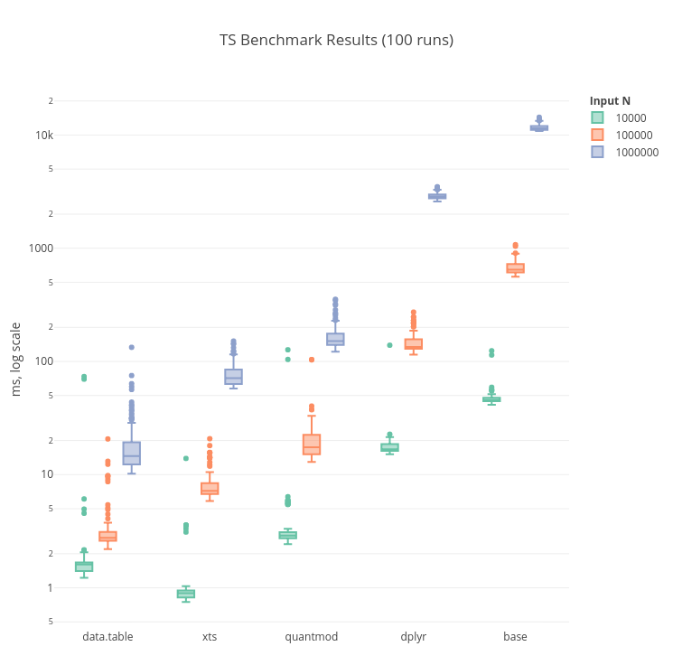

# TSBenchmark
*Performance Benchmarking of TS libraries in R*

### Task
*Transform a daily price time-series object to monthly returns.*

- **Input**: Nx2 object (N days), columns *Date* and *Price*
- **Output**: Mx2 object (M months), columns *Month* and *Return*

### Current Implementations

- xts
- data.table
- dplyr
- base
- quantmod

### Hardware
- Intel® Core™ i7-8565U CPU @ 1.80GHz × 8
- 16GB LPDDR3 2133MHz
- Ubuntu 18.04 LTS

### Results

